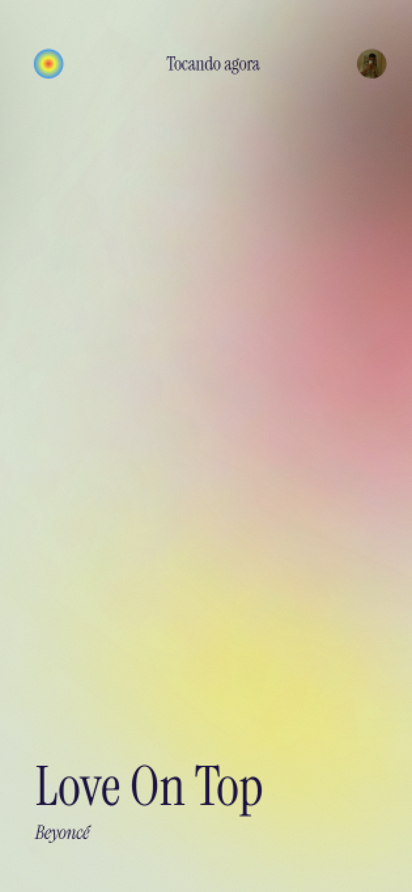
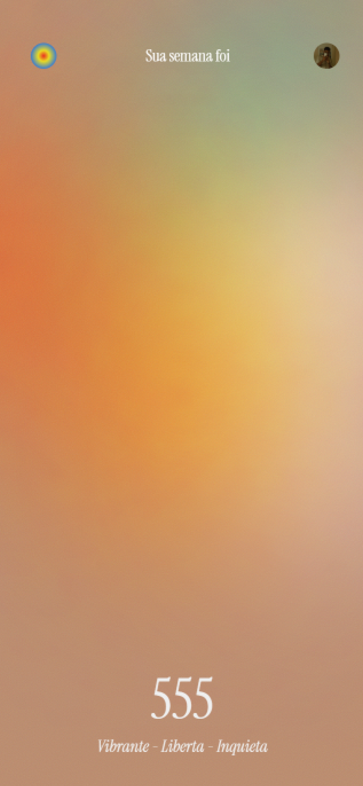

# ✨ Aura ✨

> _"Sintonize sua alma com a melodia do seu eu. Qual é a cor da sua música?"_

## 🔮 O que é o Aura?

Você já _ouviu_ música hoje... mas será que já **viu** o som?

**Aura** é um portal cósmico para quem ama música de verdade do tipo que sente cada batida no peito. Aqui, você transforma seus hábitos musicais em um espetáculo visual vibrante, colorido e dançante. Tudo isso a partir da conexão com sua conta **Last.fm**, que registra suas atividades musicais do Spotify e outras fontes.

Chega de só escutar vem **sentir, ver e viver** suas músicas favoritas.

## 🎶 O que você pode fazer?

Explore os feitiços musicais que o Aura conjura pra você:

### 🌈 Tocando Agora

A música tocou, o Aura sentiu. Veja **em tempo real** qual é a aura da sua vibe atual cores e animações que traduzem sua trilha sonora do momento, capturada pelo seu **Last.fm**.

### 🌀 Energia Semanal

Um painel emocional da sua semana em forma de um lindo mosaico 3x3 com suas músicas mais ouvidas, rastreadas pelo seu **Last.fm**. No meio? A essência da sua energia o resumo cósmico da sua vibe da semana.

### 💖 Minha Aura

A sua marca musical registrada. Descubra sua **aura pessoal** baseada na música que mais tocou seu coração nos últimos dias, com base nos seus dados do **Last.fm**. É como um horóscopo, só que com BPM e batidas.

### 🤫 Em Breve: Synesthetic

_Shhh..._ vem aí algo mágico. Uma experiência **sinestésica em tempo real**, onde cada som se transforma em luz e movimento na sua tela. Mas ó 🤫 segredo nosso por enquanto, tá?

## 🚀 Por trás da mágica

As tecnologias que fazem tudo isso acontecer (sim, usamos feitiços também, mas esses são os técnicos):

- **React**: Nosso caldeirão onde tudo é preparado.
- **TypeScript**: A magia que garante que nada saia do tom.
- **Framer Motion**: Porque aura que se preze tem que dançar.
- **Styled-components & Sass**: O glamour visual que dá vida às cores.
- **React Router DOM**: Nosso mapa para navegar entre os mundos do Aura.
- **Last.fm API**: A ponte cósmica que conecta o Aura ao seu universo musical.
- **Spotify API**: Usamos os poderes da API do Spotify para trazer as cores vibrantes das capas dos seus álbuns favoritos.

## 🛠️ Quer ver a magia de perto?

Fácil, jovem feiticeiro(a)\! Basta seguir os passos:

1.  **Crie uma conta no Last.fm:** Se você ainda não tem, o primeiro passo é se registrar em [https://www.last.fm/join](https://www.last.fm/join).

2.  **Conecte o Spotify ao Last.fm:** Nas configurações do Last.fm, autorize a conexão com o Spotify para que suas músicas sejam registradas. Você pode fazer isso em [https://www.last.fm/settings/applications](https://www.last.fm/settings/applications).

3.  **Clone o repositório do Aura:**
    \`\`\`bash
    git clone [https://github.com/pepepepu/aura.git](https://github.com/pepepepu/aura.git)
    \`\`\`

4.  **Entre na pasta:**
    \`\`\`bash
    cd aura
    \`\`\`

5.  **Instale os feitiços (dependências):**
    \`\`\`bash
    npm install
    \`\`\`

6.  **Configure suas relíquias secretas (variáveis de ambiente):**
    Crie um arquivo `.env` e adicione suas chaves mágicas:
    \`\`\`env

    # Sua chave secreta da API do Last.fm

    VITE_LASTFM_API_KEY="sua_chave_api_lastfm"

    # Sua chave compartilhada secreta do Last.fm (pode não ser estritamente necessária para este projeto)

    VITE_LASTFM_SHARED_SECRET="seu_segredo_compartilhado_lastfm"

    # Sua identificação secreta no Spotify (usada para buscar detalhes das músicas)

    VITE_SPOTIFY_CLIENT_ID="seu_client_id_spotify"

    # O portal de retorno após a autenticação do Last.fm

    VITE_LASTFM_CALLBACK_URI="seu_uri_de_callback"
    \`\`\`

7.  **Invoque o Aura localmente:**
    \`\`\`bash
    npm run dev
    \`\`\`

Abra o navegador em `localhost` e... **deixe a energia fluir\!** 🌠

## 💌 Bora trocar uma ideia?

Esse projeto foi feito com doses cavalares de cafeína, muito código e um amor imenso por música.
Feito por **Pedro Paulo (PP)**. Desenvolvedor, entusiasta musical e invocador de experiências audiovisuais.

- 📧 **E-mail:** [spedrobreno.2012@hotmail.com](mailto:spedrobreno.2012@hotmail.com)
- 💼 **LinkedIn:** [linkedin.com/in/pp-oliveira](https://www.linkedin.com/in/pp-oliveira/)

---

Se curtir o projeto, deixa uma estrela ⭐, compartilha com quem ama música e bora colorir o mundo com sons\!

---
