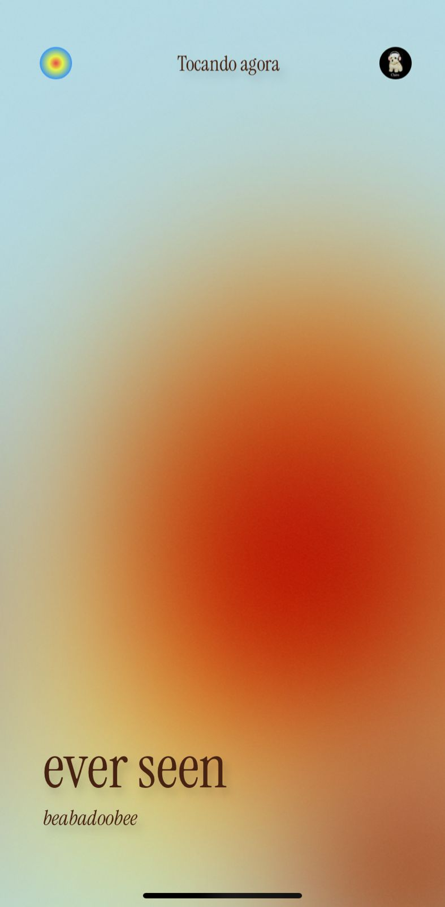
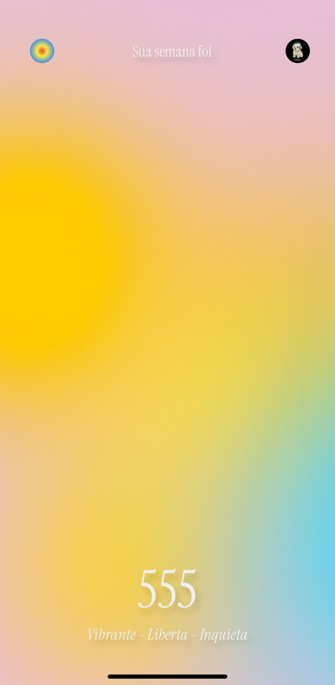
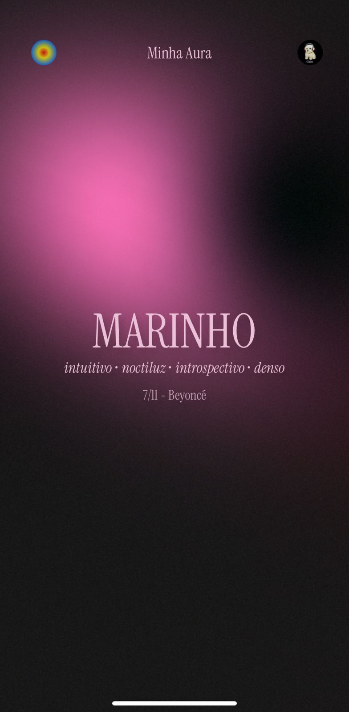
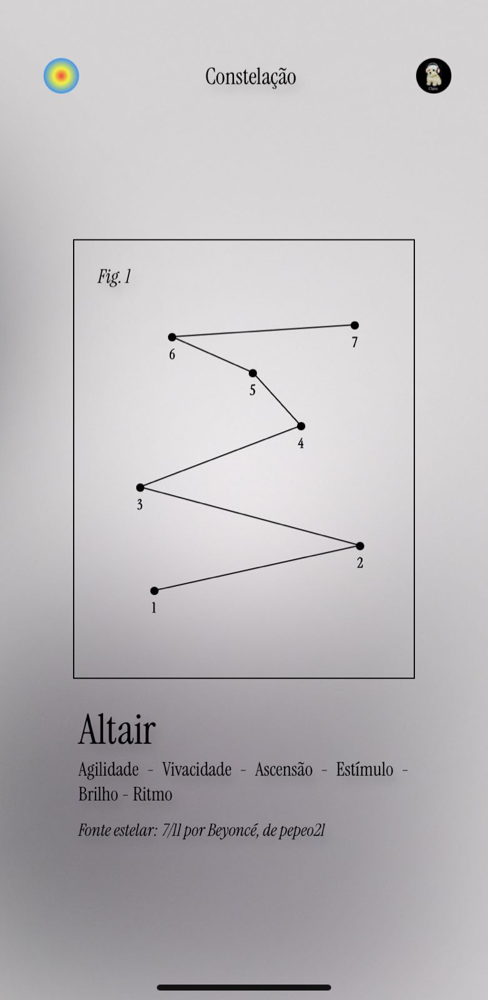

# ✨ Aura ✨

<p align="center">

</p>

> _"Sintonize sua alma com a melodia do seu eu. Qual é a cor da sua aura?"_

## 🔮 O que é o Aura?

A música que te habita não pede apenas para ser ouvida. Ela sussurra, arrepia, pulsa nas veias. Mas... e se você pudesse encará-la? Ver a cor da sua própria melancolia, a forma da sua euforia?

**Aura** é o espelho da sua alma sonora. Conectado às memórias e rastros do seu Last.fm, ele traduz o que vibra dentro de você em uma dança de luz, uma paisagem que é só sua. Seus hábitos se despem para revelar sua essência em um balé de cores vivas.

Não seja apenas o ouvinte. Venha **tocar, enxergar e se tornar** a sua música.

## 🎶 O que você pode fazer?

Explore os feitiços musicais que o Aura conjura pra você:

<p align="center">




</p>

### 🌈 Tocando Agora

A música tocou, o Aura sentiu. Veja **em tempo real** qual é a aura da sua vibe atual cores e animações que traduzem sua trilha sonora do momento.

### 🌀 Energia da semana

Aqui é onde a 9 músicas mais ouvidas pelo usuário revelam suas 9 cores da semana. Entre elas, a Cor Pai guia a escolha de um número angelical e palavras que traduzem a vibração que o universo reservou com base no que foi ouvido.

### 💖 Minha Aura

Minha Aura mergulha na canção que mais tocou sua alma, colhe as cores que dançam em suas notas e as traduz em palavras que revelam a luz, a sombra e o sopro da energia que você carrega.

### 🌠 Constelação

Constelação nasce da sua música mais ouvida, traçando nos céus os gêneros que moldam seu som. Sete pontos se acendem e se unem em desenho único, enquanto uma estrela real (escolhida pela vibração do seu gênero principal) torna-se guia da sua jornada musical.

### 🤫 Em Breve: Synesthetic

_Shhh..._ vem aí algo mágico. Uma experiência **sinestésica em tempo real**, onde cada som se transforma em luz e movimento na sua tela. Mas ó 🤫 segredo nosso por enquanto, tá?

## 🚀 Por trás da mágica

As tecnologias que manifestam essa energia:

- **React**: O núcleo onde a energia da sua alma musical toma forma.
- **TypeScript**: A sintonia fina que garante que cada vibração se mantenha pura e coesa.
- **Framer Motion**: Porque uma aura verdadeira precisa pulsar e fluir em movimento.
- **Styled-components**: O espectro de cores que dá vida e corpo à sua energia.
- **React Router DOM**: O mapa para navegar pelas diferentes camadas da sua própria Aura.
- **LastFM API**: O canal que conecta a Aura diretamente à frequência da sua alma musical.

## 🛠️ Quer sentir essa energia de perto?

Simples, explorador(a) da sua própria essência! Basta seguir os passos para sintonizar:

```bash
# Clone o repositório
git clone https://github.com/pepepepu/aura.git

# Entre na pasta
cd aura

# Instale os feitiços (dependências)
npm install

# Configure suas relíquias secretas (variáveis de ambiente)
# Crie um arquivo .env e adicione suas chaves mágicas:
```

```env
# Sua chave secreta da API do Last.fm
VITE_LASTFM_API_KEY="sua_chave_api_lastfm"

# Sua chave compartilhada secreta do Last.fm
VITE_LASTFM_SHARED_SECRET="seu_segredo_compartilhado_lastfm"

# Sua identificação secreta no Spotify (usada para buscar detalhes das músicas)
VITE_SPOTIFY_CLIENT_ID="seu_client_id_spotify"

# O portal de retorno após a autenticação do Last.fm
VITE_LASTFM_CALLBACK_URI="seu_uri_de_callback"
```

```bash
# Invoque o Aura localmente
npm run dev
```

Abra o navegador em `localhost` e... **deixe a energia fluir!** 🌠

## 💌 Bora trocar uma ideia?

Nascido da transmutação da essência em código, e de um amor que vibra na mesma frequência da música.
Criado pela alma de **Pedro Paulo (PP)**. Desenvolvedor, um ser musical e catalisador de experiências que dão corpo à energia sonora.

- 📧 **E-mail:** [spedrobreno.2012@hotmail.com](mailto:spedrobreno.2012@hotmail.com)
- 💼 **LinkedIn:** [linkedin.com/in/pp-oliveira](https://www.linkedin.com/in/pp-oliveira/)

---

Se essa vibração ressoou em você, deixe um rastro de luz com sua estrela ⭐. Compartilhe essa sintonia com outras almas musicais e vamos, juntos, manifestar o espectro visível do som.

---
